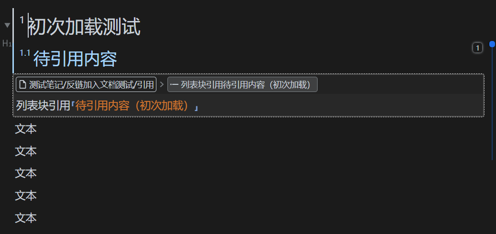

# 自定义界面插件

一系列改变界面的功能合集，涉及改变编辑器内容等危险操作，目前无上架插件市场计划。

- 将反向链接指向块插入文档
- 大纲显示反链内容（todo）

## 将反向链接指向块插入文档

❗❗ 直接使用嵌入块可以在绝大多数情况下解决问题，如非必要，不要开启此功能

目前思源笔记查看反向链接有两种方式，一是反链面板，二是在悬浮窗口中查看；本插件提供了一种更为直接的方式，即将反向链接指向的块直接插入文档 dom 中（但是并不更改笔记源文件内容，仅提供一种视图方式）。

❗❗ 由于这个插件修改了编辑器内的 dom 元素，尽管使用了一些方法，我仍无法确认这是否会带来副作用，如触发修改文档本身内容的事件。

### 使用方法

上图中虚线框即为反向链接指向的块，点击其将跳转到所在块。

### 运行流程

❗ 理解本插件的运行流程对鉴定其安全性至关重要，如对本插件安全性存在疑问，请阅读以下内容并自行决定是否使用。

1. 文档初次加载以及动态加载时，会触发 eventBus 事件，查找当前编辑器内带有反链的块
2. 在第 1 步查找到的块下添加一个嵌入块元素（不与后端通信）
3. 对第 2 步创建的嵌入块加入一个监听器，每当其更新时，移除`更新 SQL`按钮（否则会触发思源笔记错误，提示重建索引）
4. 模拟触发点击`刷新`按钮，由思源笔记自行对其进行刷新，以获取反向链接块并对嵌入块元素进行渲染
5. 插件会监听打开菜单事件，如果检测到触发菜单的块是插件添加的嵌入块，启动另一个监听器，开始对菜单的监听（否则关闭监听）
6. 当监听到菜单中元素变化时，仅保留与嵌入块有关的几个按钮，其余按钮全部设置为只读
